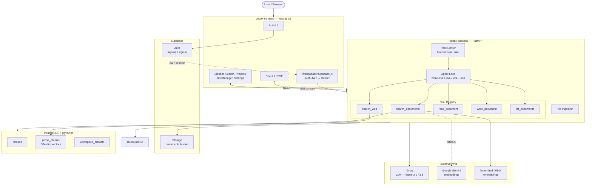

# CodexEngine Agent Architecture

## Current State (Implemented)

The following features exist on the `agentic` branch and are running in the v5 MVP:

| Feature | Source | Description |
|---|---|---|
| **Custom agent loop** | `src/agent/agent_loop.py` | Plain-dict while-true loop — LLM decides per-turn: tool call(s) or respond. No LangGraph, no DAG. |
| **Provider-agnostic LLM layer** | `src/llm/` | Abstract `LLMProvider` base + `OpenAICompatible` adapter (Groq, OpenAI, Together). Factory function selects by name. |
| **Tool registry** | `src/agent/tool_registry.py` | `@tool` decorator that auto-generates JSON schema from function signatures. `ToolRegistry` singleton installed in agent loop. |
| **Workspace artifacts** | `workspace_artifacts` DB table | Persistent documents with `(project_id, path)` UNIQUE constraint. Agent creates and reads these across turns. |
| **5 installed tools** | `src/agent/tools.py` | `search_documents`, `search_web`, `read_document`, `write_document`, `list_documents` |
| **Tool invocation logging** | `tool_invocations` DB table | Non-blocking logging of per-call duration, arguments, result/error status. |
| **Project isolation** | `project_id` field | Injected programmatically into tools (not via LLM). Default project `"default"`. |
| **Async DB** | `src/db.py` | `async_engine` (asyncpg) for endpoints and tools. Sync engine kept for ingestion. |
| **SSE streaming** | `/chat/stream` endpoint | Events: `status`, `tool_call`, `tool_result`, `token`, `done`, `error`. |
| **chat_messages persistence** | `chat_messages` DB table | Replaces LangGraph checkpointer. History stored per-thread. |

---

## Architecture

The core pattern is a **flexible agent loop** — not a hardcoded DAG. The LLM decides dynamically what to do at each turn:

```
User Message
     │
     ▼
┌──────────────────────────────┐
│     Flexible Agent Loop      │
│                              │
│  LLM decides per-turn:       │
│                              │
│  ┌──────────────────────┐    │
│  │ tool_call(s) → exec  │───→│ loop (multi-step)
│  │ respond       → emit │───→│ done
│  └──────────────────────┘    │
└──────────────────────────────┘
```

The loop is **not prescribed** — the tool registry and LLM steering determine the execution path at runtime. No hardcoded LangGraph-like DAG.

**Tool calls**: LLM requests one or more tool invocations. Results are appended to context. Loop continues.

**Direct response**: LLM produces a final answer. Streamed to user. Session ends.

---

The full system uses Supabase auth, a Next.js frontend, PostgreSQL + pgvector, and external LLM/embedding providers:



---

## Current Tools

All five tools are installed in the agent loop. The LLM calls them via auto-generated JSON schema.

| Tool | Description | Schemas |
|---|---|---|
| `search_documents` | Hybrid vector + BM25 search across uploaded documents. Returns ranked chunks with source metadata. | `query: str`, `project_id: str`, `top_k: int (default 5)` |
| `search_web` | DuckDuckGo search for external information. | `query: str`, `max_results: int (default 5)` |
| `read_document` | Full text of a workspace artifact or uploaded document. | `path: str`, `project_id: str` |
| `write_document` | Create or overwrite a workspace artifact. Returns the path. | `path: str`, `content: str`, `project_id: str`, `artifact_type: str (default "note")` |
| `list_documents` | List artifacts and uploaded documents in a project. | `project_id: str`, `prefix: str (optional)`, `limit: int (default 50)` |

The LLM handles intent classification, evaluation, and query rewriting as direct reasoning — no separate tool calls for those.

---

## Workspace Experiment

The central hypothesis of v5 is that the agent can produce and reuse persistent artifacts, evolving from a stateless Q&A bot into a knowledge workspace agent.

- **Artifact production**: Agent writes analysis, summaries, and plans to `workspace_artifacts` using `write_document`. Path conventions (`analysis/`, `summary/`, `plans/`).
- **Artifact reuse**: Agent reads artifacts it (or the user) previously wrote using `list_documents` + `read_document`. This is the key success metric — is the agent actually reading its own past output?
- **Project isolation**: All tools are scoped by `project_id`, injected programmatically in `agent_loop.py`. Users can have separate artifact namespaces per project.
- **Dogfooding**: 7-day self-guided evaluation protocol with specific prompts, expected tool call patterns, and evidence collection queries.

For full details:

- [Workspace Experiment](codex-backend/docs/workspace-experiment.md) — hypothesis, metrics, success criteria, failure modes
- [Project Isolation Validation](codex-backend/docs/project-isolation-validation.md) — 5-test plan for `project_id` correctness
- [7-Day Dogfooding Plan](docs/7-day-dogfooding-plan.md) — day-by-day protocol with exact prompts, expected tool calls, evidence SQL
- [Dogfooding Checklist](codex-backend/docs/dogfooding-checklist.md) — quick-reference scorecard

---

## Future Research (Not Implemented)

These are ideas explored in research notes and external references. Nothing here is implemented or planned for v5 MVP.

- **Memory systems**: Episodic/semantic memory, memory recall tools, per-project memory stores. See `codex-backend/docs/future-memory-model.md` for research notes — do not implement.
- **MCP adapter**: Dynamic discovery of external tools via Model Context Protocol (Notion, Google Docs, Confluence). Our `@tool` decorator + in-process registry is sufficient for MVP.
- **Subagents**: Spawning child agents with narrowed tools/context for parallel exploration. Not needed until multi-topic document research is required.
- **External integrations**: Third-party API connectors beyond DuckDuckGo (e.g., Notion API, Google Drive, Slack).
- **Knowledge graph**: Entity extraction, relationship mapping, graph-based retrieval augmentation.

---

## Explicit Non-Goals For v5 MVP

The following are intentionally postponed. They may be considered after the workspace experiment is validated or abandoned:

- **MCP** — No JSON-RPC tool adapters. Our `@tool` decorator + registry is sufficient.
- **Subagents** — No `spawn_subagent` tool or child agent lifecycle.
- **Workflow engine** — No DAG, no pipeline, no state machine. The loop is while-true.
- **Task system** — No task tracking, task states, or task list UI.
- **Knowledge graph** — No entity extraction or graph database.
- **Memory architecture** — No separate `memory/`, `skills/`, `decisions/` stores. Everything collapses to `workspace_artifacts` until the experiment proves out.
- **Permission scoping** — Single-user app; every tool is available to the agent.
- **Token-level SSE streaming** — Current implementation streams full chunks; fine-grained per-token streaming deferred.

## What Stays from v4.0

- Supabase auth + storage
- FastAPI server + endpoints
- SSE streaming pattern
- Frontend Next.js app
- Dual-mode embeddings (fastembed / Gemini fallback)

---

## References (Research)

- [opencode](https://github.com/anomalyco/opencode) — tool registry design, session processor
- [Codex CLI](https://github.com/openai/codex) — sandbox isolation, session-based persistence
- [Terminus-2 / Harbor](https://www.harborframework.com/docs/agents/terminus-2) — mono-tool loop, 3-step summarization, ATIF trajectory format
- [Pi](https://github.com/earendil-works/pi) — two-level loop, parallel tool execution, event-system via SSE
