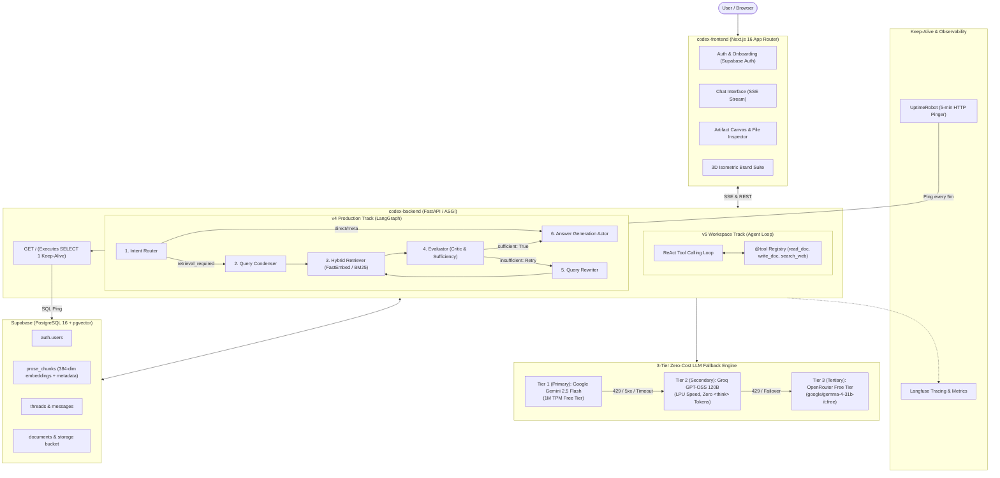

# CodexEngine — Architectural Specification

> **System Version:** v4.0 (Production Stable) & v5.0 (Autonomous Workspace Agent)  
> **Status:** Active / Production Deployed  
> **Last Updated:** August 2026

---

## 1. Executive Summary & Vision

**CodexEngine** is an enterprise-grade document intelligence and autonomous workspace platform designed to bridge stateful multi-tenant knowledge retrieval with agentic execution.

The repository operates on a **Dual-Track Architecture**:
1. **v4 (`main`) — Stateful Cognitive RAG Engine:** A deterministic, evaluated LangGraph Actor-Critic state machine designed for production document Q&A, metadata-aware hybrid retrieval, and sub-second semantic search.
2. **v5 (`agentic`) — Autonomous Knowledge Workspace Agent:** A dynamic tool-calling ReAct agent loop equipped with an interactive Artifact Canvas, direct workspace file operations, and multi-tenant project isolation.

---

## 2. System Architecture Diagram



---

## 3. Subsystem Breakdown

### 3.1. 3-Tier Zero-Cost LLM Fallback Architecture
To achieve 99.99% uptime on $0 infrastructure costs, CodexEngine implements a unified LangChain `ChatOpenAI` cascading fallback in [`src/llm.py`](file:///home/anmol/Projects/CodexEngine/codex-backend/src/llm.py):

| Layer | Provider | Model Identifier | Free Tier Limits | Key Advantage |
| :--- | :--- | :--- | :--- | :--- |
| **Tier 1 (Primary)** | Google AI Studio | `gemini-2.5-flash` | 15 RPM / 1M TPM / 1,500 RPD | Zero 404s, 1M context window, eliminates CI rate limits |
| **Tier 2 (Secondary)** | Groq LPU | `openai/gpt-oss-120b` | 30 RPM / 8k TPM | Blazing LPU inference speed, native instruction format (zero `<think>` corruption) |
| **Tier 3 (Tertiary)** | OpenRouter | `google/gemma-4-31b-it:free` | $0.00 / 1M tokens | Reliable public fallback safety net |

```python
# Chained Fallback Implementation
primary = providers[0]       # Tier 1: Gemini 2.5 Flash
fallbacks = providers[1:]    # Tier 2: Groq GPT-OSS 120B, Tier 3: OpenRouter Gemma
return primary.with_fallbacks(fallbacks) if fallbacks else primary
```

### 3.2. Hybrid Embeddings & Retrieval Engine
CodexEngine operates a RAM-adaptive embedding strategy:
* **Local-First Embedding (Default):** FastEmbed (`BAAI/bge-small-en-v1.5`) running locally in-process via ONNX Runtime CPU. Emits 384-dimensional dense vectors with zero API latency.
* **Cloud Fallback:** Automatically switches to Google Gemini `text-embedding-004` if system RAM < 1.5 GB or when deployed on minimal cloud containers (`RENDER="true"`).
* **Sparse Indexing:** Rank-BM25 indexed over document tokens and metadata filenames (`source: "tasks.txt"`), ensuring exact filename queries resolve accurately.

### 3.3. Keep-Alive & Infrastructure Self-Healing
* **The Problem:** Free-tier cloud hosts (Render) sleep after 15 minutes of idle HTTP, and free-tier databases (Supabase) auto-pause after 7 days of inactivity.
* **The Solution:** UptimeRobot pings `GET /` every 5 minutes. The root handler in `server.py` executes an active `SELECT 1;` query through SQLAlchemy/psycopg. This keeps both the compute container warm and prevents Supabase from pausing.

### 3.4. Brand & UI Design System
* **Brand Geometry:** 3D Isometric Knowledge Stack representing the three cognitive tiers (Agent Core, Hybrid Retrieval, Storage Foundation).
* **Assets:**
  - `app/icon.svg` & `public/favicon.svg`: Scalable vector browser tab favicons.
  - `public/favicon.ico`: Multi-resolution binary ICO (`16x16`, `32x32`, `48x48`, `64x64`).
  - `public/logo.svg` & `public/apple-touch-icon.svg`: Master high-res vectors.
  - `components/CodexLogo.tsx`: In-app React component integrated into Sidebar, Context Drawers, and Login hero sections.

---

## 4. Architectural Trade-offs & Decisions

### Why Qwen 3.6 27B Was Replaced by GPT-OSS 120B / Gemini
* **Thinking Token Pollution:** Qwen 3.6 emits internal `<think>...</think>` tokens before its final answers.
* **Downstream Breakage:**
  - `router.py`: Leading `<think>` strings broke exact string matching, misrouting queries to `retrieval_required`.
  - `evaluator.py`: `json.loads` crashed on non-JSON thinking headers, forcing infinite rewrite loops.
  - `condenser.py` & `rewriter.py`: Thinking thoughts contaminated vector embeddings.
  - **Rate Limits:** Verbose reasoning tokens caused rapid 429 TPM exhaustion on Groq.
* **Resolution:** Gemini 2.5 Flash and Groq GPT-OSS 120B output clean direct markdown/JSON responses without prompt pollution.

### Linear RAG vs Actor-Critic (v4) vs Autonomous Agent (v5)
* **v4 Actor-Critic State Machine:** Provides predictable, deterministic latency and strict guardrails suitable for high-volume enterprise document querying.
* **v5 ReAct Agent Loop:** Unlocks multi-turn autonomous problem solving (reading, editing, creating artifacts, and executing multi-step research) with user-in-the-loop canvas controls.

---

## 5. Security & Isolation Model

* **Multi-Tenant Isolation:** Supabase Row Level Security (RLS) policies enforce data partitioning by `user_id` and `project_id`.
* **Token Authentication:** Supabase JWT Bearer authentication parsed via FastAPI dependency middleware.
* **Zero Hardcoded Secrets:** All credentials injected via environment variables with strictly zero secret commits.
