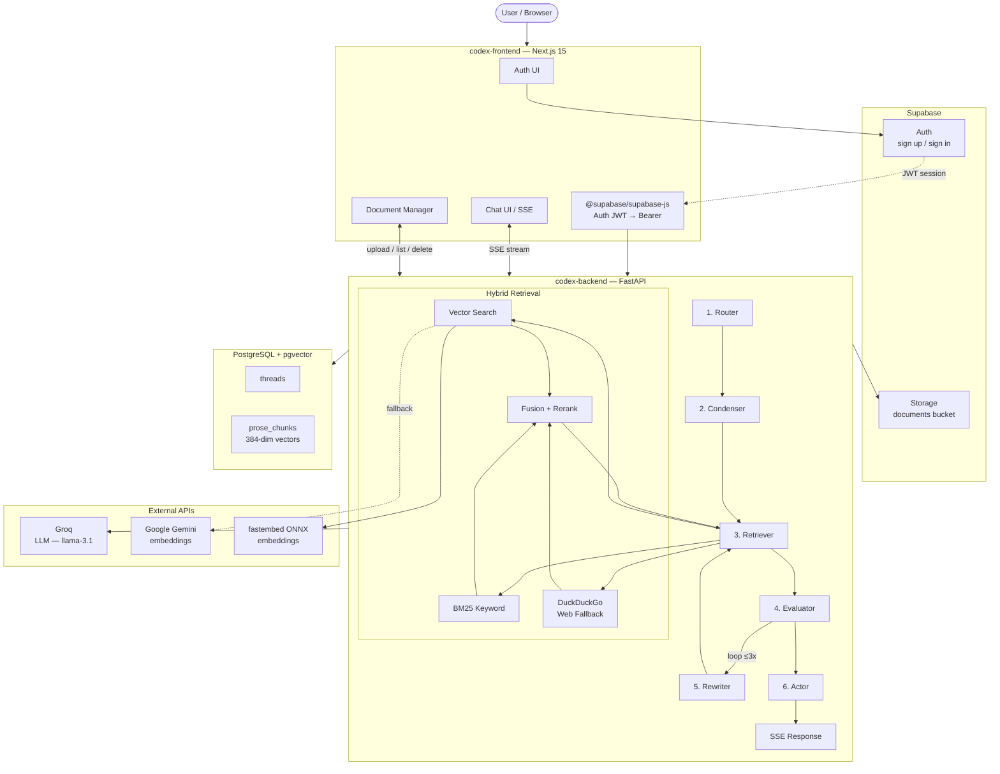

# CodexEngine

Upload documents, ask questions, get answers backed by your own knowledge base.

A personalized AI research assistant — you feed it PDFs, it indexes them, and you chat with your documents using a multi-agent RAG pipeline. Think NotebookLM, but self-hosted and developer-friendly.

## Quick Start

```bash
git clone https://github.com/anmolsharma152/CodexEngine.git
cd CodexEngine

# Backend
cd codex-backend
python3 -m venv .venv && source .venv/bin/activate
pip install -r requirements.txt
cp .env.example .env   # fill in your keys
uvicorn server:app --reload --host 127.0.0.1 --port 8000

# Frontend (new terminal)
cd codex-frontend
npm install && npm run dev
```

Set `NEXT_PUBLIC_SUPABASE_URL`, `NEXT_PUBLIC_SUPABASE_ANON_KEY`, `NEXT_PUBLIC_API_URL` in `codex-frontend/.env.local`. Open `http://localhost:3000` — register, upload a PDF, and start asking questions.

## How It Works

When you ask a question, CodexEngine:

1. Decides if it needs to search your documents or can answer directly
2. Searches your indexed content using vector similarity + keyword search + optional web fallback
3. Scores and reranks the results
4. Generates an answer with source citations (`[p. X]`, `[r. X]`, `[doc]`, `[web]`)

All of this runs through a LangGraph agent pipeline with self-evaluation loops (up to 3 retries if the initial answer is weak).

### Running Modes

| Feature | Local / CI | Production (Render 512MB) |
|---|---|---|
| Embeddings | fastembed ONNX (`bge-small-en-v1.5`) | Google Gemini API |
| Reranker | CrossEncoder (`ms-marco-MiniLM-L-6-v2`) | Score-based sort |
| Detection | `MemTotal > 1.5GB` or no `RENDER` env | `RENDER=true` or `< 1.5GB` |

Both modes produce 384-dimensional vectors.

## Architecture



## Testing

```bash
cd codex-backend
source .venv/bin/activate
python tests/test_golden.py       # Single golden query
python tests/test_rigorous.py     # Full sweep
python eval/ragas_eval.py         # RAGAS metrics
```

## Learn More

- [Deployment guide](docs/deployment.md) — Render, Vercel, Supabase setup
- [API reference](docs/api.md) — endpoint table with request/response examples
