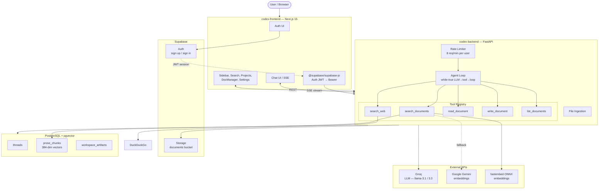

# CodexEngine

**Upload documents, ask questions, get answers backed by your own knowledge base.**

A self-hosted document intelligence tool — you feed it PDFs, it indexes them, and you chat with your documents with source citations. Think NotebookLM, but self-hosted and developer-friendly.

| Branch | Status | What it does |
|---|---|---|
| `main` | **Stable (v4)** | Research engine — upload, index, chat, citations |
| `agentic` | **Experimental (v5)** | Workspace agent — agent creates and reads persistent artifacts |

---

## Quick Start

```bash
git clone https://github.com/anmolsharma152/CodexEngine.git
cd CodexEngine

# Backend
cd codex-backend
python3 -m venv .venv && source .venv/bin/activate
pip install -r requirements.txt
cp .env.example .env   # fill in your keys
uvicorn server:app --reload --host 127.0.0.1 --port 8000

# Frontend (new terminal)
cd codex-frontend
npm install && npm run dev
```

Set `NEXT_PUBLIC_SUPABASE_URL`, `NEXT_PUBLIC_SUPABASE_ANON_KEY`, `NEXT_PUBLIC_API_URL` in `codex-frontend/.env.local`. Open `http://localhost:3000` — register, upload a PDF, and start asking questions.

---

## How It Works

When you ask a question, CodexEngine runs a **flexible agent loop** — the LLM decides dynamically which tools to call and in what order:

1. **Search documents** — Hybrid vector + BM25 search across your indexed documents
2. **Search web** — DuckDuckGo fallback for external information
3. **Generate** — Produces a final answer with source citations (`[p. X]`, `[r. X]`, `[doc]`, `[web]`)

On the `agentic` branch, three additional tools enable workspace artifact production:
`read_document`, `write_document`, and `list_documents`.

All of this runs through a custom while-true agent loop (replacing the old LangGraph pipeline). The LLM has access to tool functions and decides per-turn whether to call a tool or respond directly.

### Running Modes

| Feature | Local / CI | Production (Render 512MB) |
|---|---|---|
| Embeddings | fastembed ONNX (`bge-small-en-v1.5`) | Google Gemini API |
| Reranker | CrossEncoder (`ms-marco-MiniLM-L-6-v2`) | Score-based sort |
| Detection | `MemTotal > 1.5GB` or no `RENDER` env | `RENDER=true` or `< 1.5GB` |

Both modes produce 384-dimensional vectors.

---

## Architecture



---

## Branches

### `main` — v4 (Stable Research Engine)

The production-deployed version.
- LangGraph-based RAG pipeline (legacy, replaced in v5)
- Upload PDFs, chat with documents, get cited answers
- Deployed on Render + Vercel

### `agentic` — v5 (Experimental Workspace Agent)

Active development branch.
- Custom while-true agent loop (no LangGraph)
- `@tool` decorator registry with 5 tools
- Provider-agnostic LLM layer (Groq, OpenAI, Together, Gemini)
- Persistent workspace artifacts — agent writes `analysis/`, `plans/`, `decisions/`
- Tool invocation logging
- Subject to rebasing and API changes

---

## Testing

```bash
cd codex-backend
source .venv/bin/activate
python tests/test_golden.py       # Single golden query
python tests/test_rigorous.py     # Full sweep
python eval/ragas_eval.py         # RAGAS metrics
```

---

## Learn More

- [Deployment guide](docs/deployment.md) — Render, Vercel, Supabase setup
- [API reference](docs/api.md) — endpoint table with request/response examples
- [Agent architecture](AGENTS.md) — agent loop design, tool registry, reference research
- [Workspace experiment](codex-backend/docs/workspace-experiment.md) — v5 artifact production hypothesis and results
