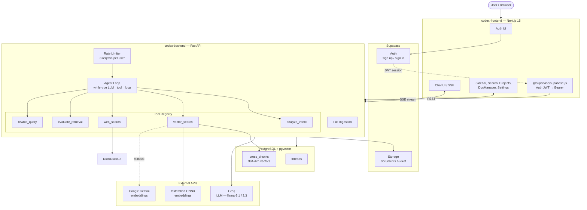

# CodexEngine

Upload documents, ask questions, get answers backed by your own knowledge base.

A personalized AI research assistant — you feed it PDFs, it indexes them, and you chat with your documents. Think NotebookLM, but self-hosted and developer-friendly.

> **v4.0** is stable on `main` (LangGraph pipeline, deployed Render + Vercel).  
> **v5.0** is in progress on `agentic` (custom agent loop, tool-based architecture).

## Quick Start

```bash
git clone https://github.com/anmolsharma152/CodexEngine.git
cd CodexEngine

# Backend
cd codex-backend
python3 -m venv .venv && source .venv/bin/activate
pip install -r requirements.txt
cp .env.example .env   # fill in your keys
uvicorn server:app --reload --host 127.0.0.1 --port 8000

# Frontend (new terminal)
cd codex-frontend
npm install && npm run dev
```

Set `NEXT_PUBLIC_SUPABASE_URL`, `NEXT_PUBLIC_SUPABASE_ANON_KEY`, `NEXT_PUBLIC_API_URL` in `codex-frontend/.env.local`. Open `http://localhost:3000` — register, upload a PDF, and start asking questions.

## How It Works

When you ask a question, CodexEngine runs a **flexible agent loop** — the LLM decides dynamically which tools to call and in what order:

1. **Analyze intent** — Classifies whether the query needs document search, general knowledge, or casual response
2. **Search** — Hybrid vector + BM25 search across your indexed documents, with optional web fallback
3. **Evaluate** — Checks if retrieved context is sufficient; rewrites query and retries if not (up to 3 retries)
4. **Generate** — Produces a final answer with source citations (`[p. X]`, `[r. X]`, `[doc]`, `[web]`)

All of this runs through a custom while-true agent loop (replaced the old LangGraph pipeline). The LLM has access to 5 tool functions and decides per-turn whether to call a tool or respond directly.

### Running Modes

| Feature | Local / CI | Production (Render 512MB) |
|---|---|---|
| Embeddings | fastembed ONNX (`bge-small-en-v1.5`) | Google Gemini API |
| Reranker | CrossEncoder (`ms-marco-MiniLM-L-6-v2`) | Score-based sort |
| Detection | `MemTotal > 1.5GB` or no `RENDER` env | `RENDER=true` or `< 1.5GB` |

Both modes produce 384-dimensional vectors.

## Architecture



## v5.0 Changes (agentic branch)

| Before (v4.0) | After (v5.0) |
|---|---|
| LangGraph StateGraph with hardcoded DAG | Custom while-true agent loop |
| 6 fixed pipeline nodes | 5 @tool functions, LLM decides flow |
| Monolith page.tsx (2000+ lines) | 20+ decomposed components |
| CSS in-page with tailwind classes | shadcn/ui v4 with dark design system |
| No per-user rate limiting | 8 req/min per user on /chat/stream |
| No message editing | Slash commands + edit button |
| No projects or search | ProjectSelector + SearchChat |
| Desktop-only sidebar | Mobile-responsive overlay |

## Testing

```bash
cd codex-backend
source .venv/bin/activate
python tests/test_golden.py       # Single golden query
python tests/test_rigorous.py     # Full sweep
python eval/ragas_eval.py         # RAGAS metrics
```

## Learn More

- [Deployment guide](docs/deployment.md) — Render, Vercel, Supabase setup
- [API reference](docs/api.md) — endpoint table with request/response examples
- [Agent architecture](AGENTS.md) — agent loop design, tool registry, reference research
