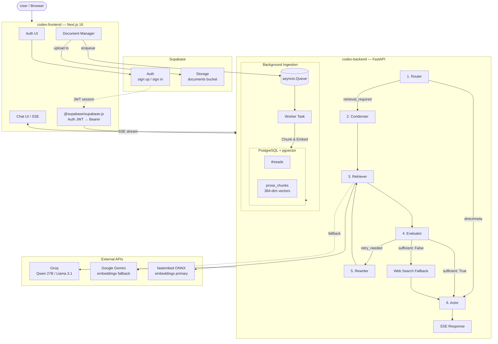
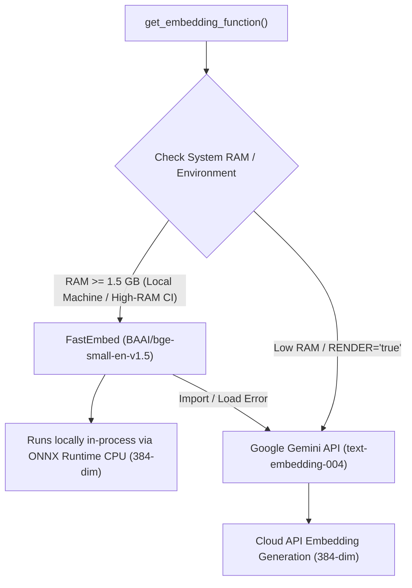

# Architecture Overview

CodexEngine is a multi-tenant document intelligence platform built on a hybrid retrieval architecture.

## System Architecture

## Embeddings & Hybrid Fallback Architecture

CodexEngine employs a hybrid local-first embedding strategy (`src/repositories/utils.py`) to maximize local inference speed and eliminate API costs, while seamlessly falling back to Google Gemini on low-RAM server environments:

